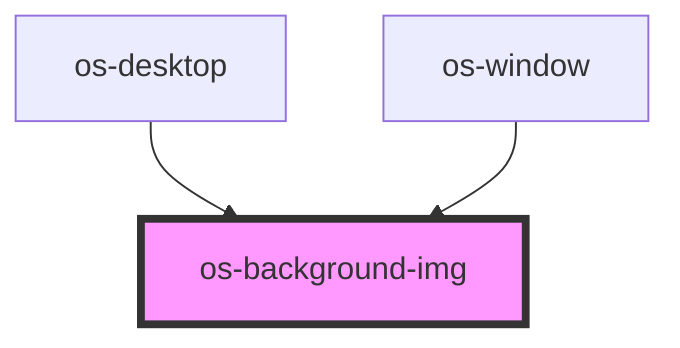

# os-background-img

<!-- Auto Generated Below -->

## Properties

| Property | Attribute | Description | Type     | Default                                     |
| -------- | --------- | ----------- | -------- | ------------------------------------------- |
| `img`    | `img`     | 背景图片        | `string` | `'url(./assets/images/default_bk_img.jpg)'` |

## Dependencies

### Used by

 - [os-desktop](../os-desktop)
 - [os-window](../os-window)

### Graph

----------------------------------------------

*Built with [StencilJS](https://stenciljs.com/)*
