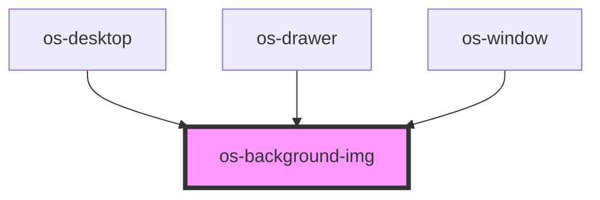

# os-background-img

<!-- Auto Generated Below -->

## Properties

| Property   | Attribute   | Description | Type                 | Default     |
| ---------- | ----------- | ----------- | -------------------- | ----------- |
| `color`    | `color`     | 背景颜色        | `string`             | `'black'`   |
| `img`      | `img`       | 背景图片        | `string`             | `undefined` |
| `showMode` | `show-mode` |             | `"color" \| "image"` | `undefined` |

## Dependencies

### Used by

 - [os-desktop](../os-desktop)
 - [os-drawer](../os-drawer)
 - [os-window](../os-window)

### Graph

----------------------------------------------

*Built with [StencilJS](https://stenciljs.com/)*
