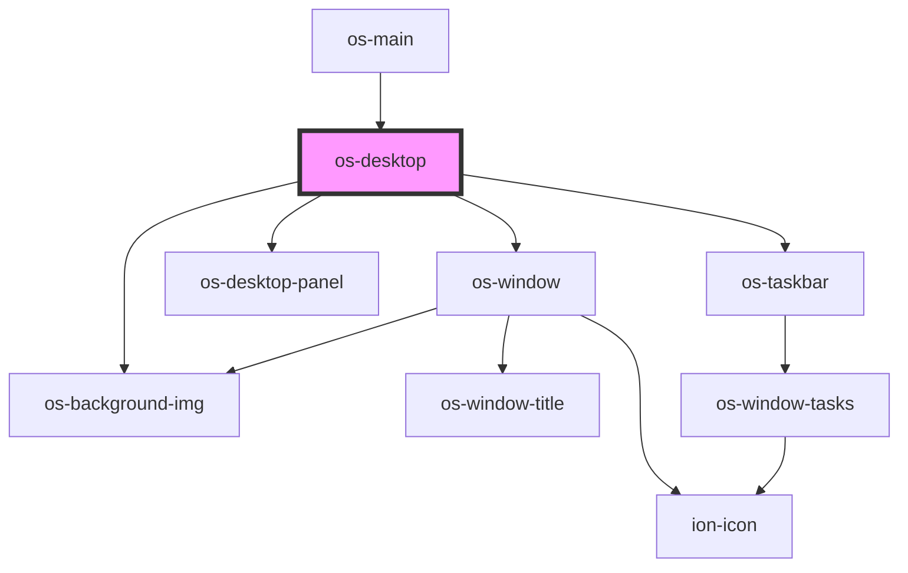

# os-desktop

<!-- Auto Generated Below -->

## Properties

| Property     | Attribute | Description | Type                | Default     |
| ------------ | --------- | ----------- | ------------------- | ----------- |
| `controller` | --        | 桌面控制        | `DesktopController` | `undefined` |

## Dependencies

### Used by

 - [os-main](../os-main)

### Depends on

- [os-window](../os-window)
- [os-background-img](../os-background-img)
- [os-desktop-panel](../os-desktop-panel)
- [os-taskbar](../os-taskbar)

### Graph

----------------------------------------------

*Built with [StencilJS](https://stenciljs.com/)*
