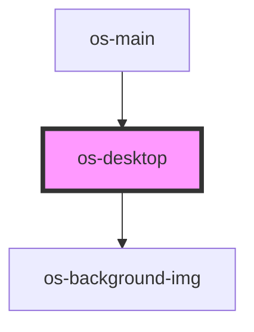

# os-desktop

<!-- Auto Generated Below -->

## Properties

| Property | Attribute | Description | Type               | Default     |
| -------- | --------- | ----------- | ------------------ | ----------- |
| `sys`    | --        | 控制器         | `SystemController` | `undefined` |

## Dependencies

### Used by

 - [os-main](../os-main)

### Depends on

- [os-background-img](../os-background-img)

### Graph

----------------------------------------------

*Built with [StencilJS](https://stenciljs.com/)*
