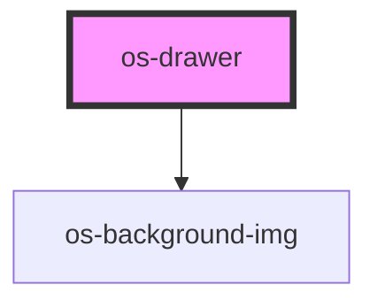

# os-drawer

<!-- Auto Generated Below -->

## Properties

| Property   | Attribute  | Description | Type                                     | Default     |
| ---------- | ---------- | ----------- | ---------------------------------------- | ----------- |
| `position` | `position` | 抽屉打开方向      | `"bottom" \| "left" \| "right" \| "top"` | `'right'`   |
| `zIndex`   | `z-index`  | 显示层级        | `number`                                 | `undefined` |

## Dependencies

### Depends on

- [os-background-img](../os-background-img)

### Graph

----------------------------------------------

*Built with [StencilJS](https://stenciljs.com/)*
