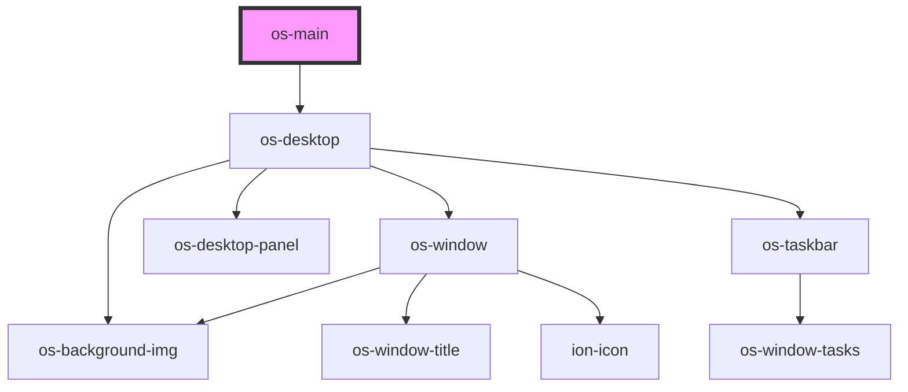

# os-main

<!-- Auto Generated Below -->

## Dependencies

### Depends on

- [os-desktop](../os-desktop)

### Graph

----------------------------------------------

*Built with [StencilJS](https://stenciljs.com/)*
