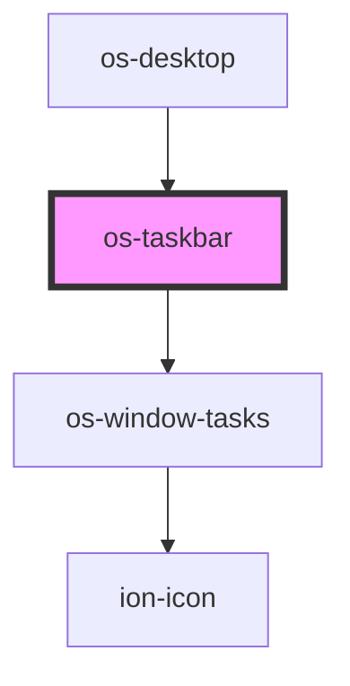

# os-taskbar

<!-- Auto Generated Below -->

## Properties

| Property  | Attribute | Description | Type                | Default     |
| --------- | --------- | ----------- | ------------------- | ----------- |
| `desktop` | --        | 桌面控制器       | `DesktopController` | `undefined` |

## Dependencies

### Used by

 - [os-desktop](../os-desktop)

### Depends on

- [os-window-tasks](../os-window-tasks)

### Graph

----------------------------------------------

*Built with [StencilJS](https://stenciljs.com/)*
