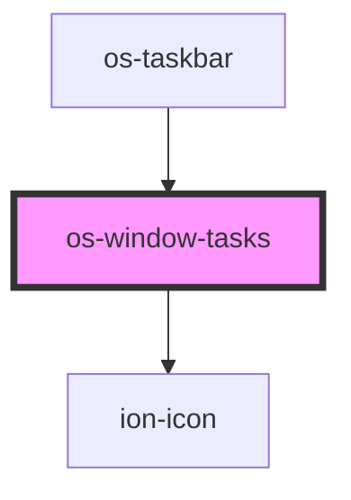

# os-window-tasks

<!-- Auto Generated Below -->

## Properties

| Property  | Attribute | Description | Type                | Default     |
| --------- | --------- | ----------- | ------------------- | ----------- |
| `desktop` | --        | 桌面控制器       | `DesktopController` | `undefined` |

## Dependencies

### Used by

 - [os-taskbar](../os-taskbar)

### Depends on

- ion-icon

### Graph

----------------------------------------------

*Built with [StencilJS](https://stenciljs.com/)*
