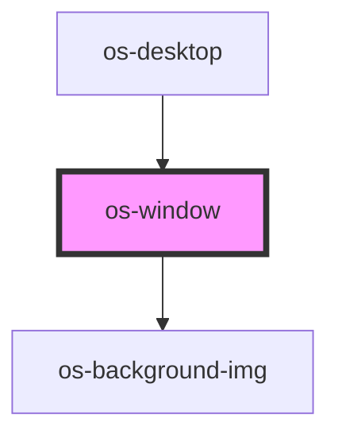

# os-window

<!-- Auto Generated Below -->

## Dependencies

### Used by

 - [os-desktop](../os-desktop)

### Depends on

- [os-background-img](../os-background-img)

### Graph

----------------------------------------------

*Built with [StencilJS](https://stenciljs.com/)*
