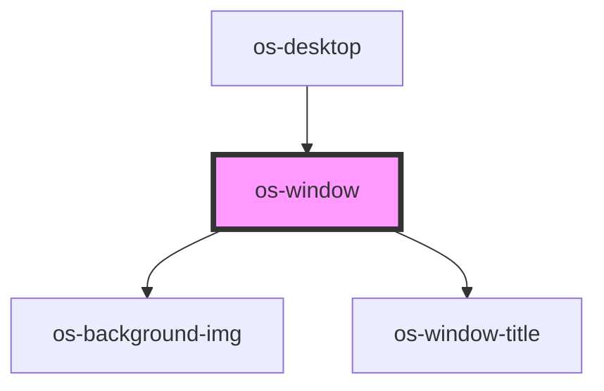

# os-window

<!-- Auto Generated Below -->

## Properties

| Property     | Attribute | Description | Type               | Default     |
| ------------ | --------- | ----------- | ------------------ | ----------- |
| `controller` | --        | window控制器   | `WindowController` | `undefined` |

## Dependencies

### Used by

 - [os-desktop](../os-desktop)

### Depends on

- [os-background-img](../os-background-img)
- [os-window-title](../os-window-title)

### Graph

----------------------------------------------

*Built with [StencilJS](https://stenciljs.com/)*
